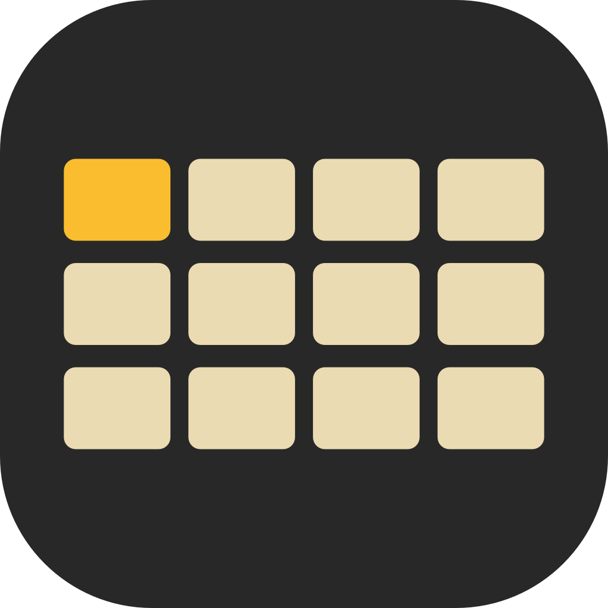
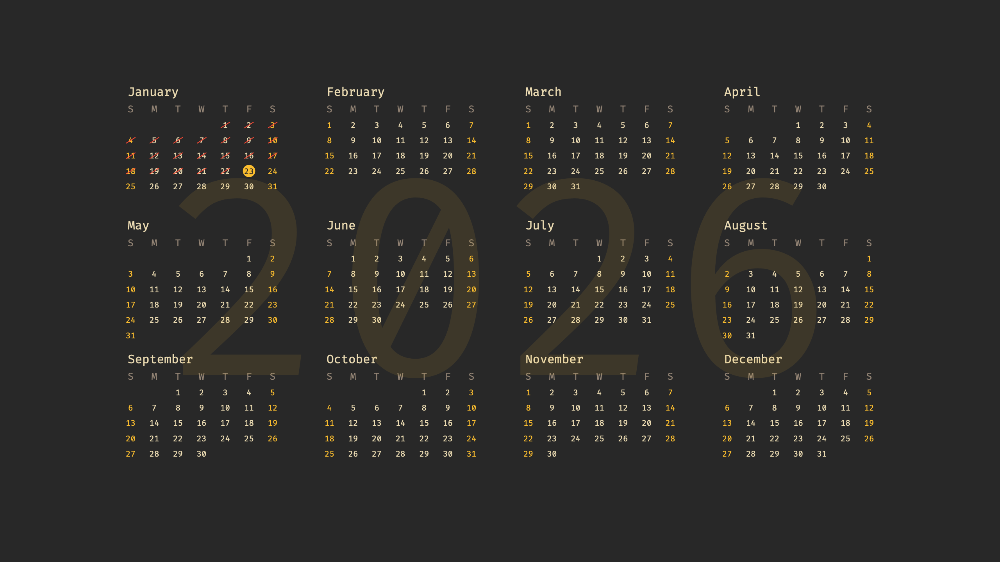

# YearView - Calendar Wallpaper for macOS

<p align="center">
  
</p>

A minimal macOS menu bar app that generates desktop wallpapers with a full-year calendar view. Features 36 themes inspired by [typings.gg](https://github.com/briano1905/typings) and the mechanical keyboard community.


## Features

- **Full Year Calendar**: All 12 months displayed in a clean 4x3 grid
- **36 Themes**: Nord, Dracula, Gruvbox, Monokai, and many more
- **Today Highlight**: Current date prominently highlighted with accent color
- **Weekend Styling**: Weekend days styled distinctly
- **Automatic Updates**: Wallpaper refreshes at midnight
- **Menu Bar App**: Runs quietly in the menu bar, no dock icon
- **Retina Support**: Sharp rendering on all display resolutions
- **Customizable Layout**: Adjust margins and font settings

## Screenshots



The wallpaper displays a yearly calendar with your selected theme:

- Year watermark in the center (subtle, 10% opacity)
- 4 columns x 3 rows month layout
- Current day highlighted with accent color circle
- Weekends shown in accent color

## Installation

### Requirements

- macOS 13.0 (Ventura) or later
- Xcode 15.0 or later (for building)

### Building from Source

1. Clone the repository:
   ```bash
   git clone https://github.com/yourusername/yearview.git
   cd yearview
   ```

2. Open the Xcode project:
   ```bash
   open YearView/YearView.xcodeproj
   ```

3. Build and run (Cmd+R)

4. The app will appear in your menu bar with a calendar icon

## Usage

### Menu Bar

Click the calendar icon in the menu bar to access:

- **Theme Picker**: Select from 36 available themes
- **Settings**: Customize margins, font, and other options
- **Quit**: Exit the application

### Changing Themes

1. Click the calendar icon in the menu bar
2. Use the theme picker to browse available themes
3. Click a theme to apply it immediately

### Settings

Access Settings from the menu bar to customize:

- **Horizontal Margin**: Adjust left/right padding
- **Vertical Margin**: Adjust top/bottom padding
- **Font Family**: Choose your preferred font
- **Mark Passed Days**: Optionally show a line through past dates

## Themes

### Popular Themes

| Theme | Style | Best For |
|-------|-------|----------|
| Nord | Dark, arctic blue | Professional, clean look |
| Dracula | Dark, purple accent | Developers, night owls |
| Gruvbox | Dark, warm browns | Retro aesthetic |
| Mizu | Light, water blue | Calm, refreshing feel |
| 8008 | Dark, hot pink | Bold, vibrant style |
| Olivia | Dark, rose accent | Elegant, sophisticated |

## Project Structure

```
YearView/
├── YearView/
│   ├── YearView/                    # Main app source
│   │   ├── YearViewApp.swift
│   │   ├── YearView.entitlements
│   │   ├── Assets.xcassets/
│   │   │   ├── AppIcon.appiconset/
│   │   │   └── AccentColor.colorset/
│   │   ├── Models/
│   │   │   ├── CalendarModels.swift
│   │   │   └── Theme.swift
│   │   ├── Services/
│   │   │   ├── CalendarGenerator.swift
│   │   │   ├── DailyScheduler.swift
│   │   │   ├── LayoutSettings.swift
│   │   │   ├── ThemeManager.swift
│   │   │   ├── ThemeStore.swift
│   │   │   ├── WallpaperManager.swift
│   │   │   ├── WallpaperRenderer.swift
│   │   │   └── WallpaperService.swift
│   │   ├── Views/
│   │   │   ├── MenuContentView.swift
│   │   │   ├── SettingsWindow.swift
│   │   │   └── ThemePickerView.swift
│   │   ├── Utilities/
│   │   │   └── Extensions.swift
│   │   └── Resources/
│   │       └── Info.plist
│   ├── YearView.xcodeproj/
│   ├── YearViewTests/
│   └── YearViewUITests/
├── README.md
├── LICENSE
├── CONTRIBUTING.md
├── Screenshot.png
└── YearView.png
```

## Technical Details

- **Framework**: SwiftUI with AppKit for rendering
- **Architecture**: SwiftUI App lifecycle with `@StateObject` and `@EnvironmentObject`
- **Rendering**: Core Graphics for high-quality image generation
- **Wallpaper API**: NSWorkspace for system wallpaper management
- **Storage**: UserDefaults for theme and settings persistence
- **Performance**: Background rendering, automatic cleanup of old wallpaper files

## Roadmap

- [ ] Custom theme creation UI
- [ ] Holiday/event markers
- [ ] Launch at login option
- [ ] Theme import/export

## Contributing

Contributions are welcome! Please see [CONTRIBUTING.md](CONTRIBUTING.md) for guidelines.

## Credits

- Theme colors inspired by [typings.gg](https://github.com/briano1905/typings) by [@briano1905](https://github.com/briano1905)
- Color schemes from Dracula, Nord, Solarized, Gruvbox, Monokai, and GMK keycap sets

## License

MIT License - see [LICENSE](LICENSE) for details.
